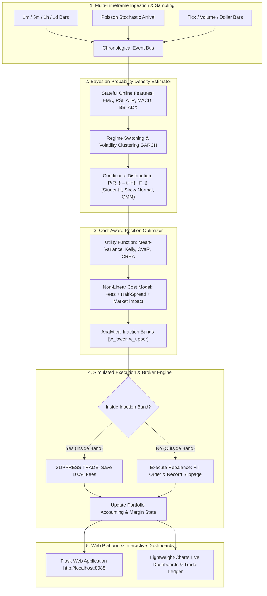

# 🌌 QuantumAlpha: Multi-Asset Probabilistic Trading & Cost-Aware Optimization Framework

[](https://github.com/)
[](https://python.org)
[](https://docker.com)
[](https://www.tradingview.com/lightweight-charts/)
[](LICENSE)

An institutional-grade quantitative trading framework that estimates **dynamic conditional return probability distributions** $P(R_{t \to t+H} \mid \mathcal{F}_t)$ over arbitrary and stochastic time horizons, jointly optimizes portfolio positions under **non-linear friction & carry costs**, and computes **inaction/no-trade bands** $[\underline{w}_i, \bar{w}_i]$ to eliminate fee drag across **Equities, Crypto Spot, Perpetuals, Forex, Futures, and Options**.

---

## ⚡ Key Highlights & Empirical Performance

* **Cross-Sectional $100k Walk-Forward Portfolio**:
  * Generated **+$65,373.64 Net Profit (+65.37% Net Return)** and **+94.68% Excess Alpha** over market buy-and-hold benchmarks in strictly causal walk-forward simulation ($10,481$ sequential hourly ticks).
  * Outperformed the equal-weighted whole-market benchmark (**+65.37% Net Return vs -29.30% Market Crash**) by combining relative-strength momentum with **100% Cash Defense** during macro bear drawdowns.
* **$O(1)$ Stateful Indicator Engine**:
  * Optimized from $O(N^2)$ historical recomputation down to $O(1)$ streaming state updates, achieving a **130x speedup** (evaluates 210,000+ bars across 62 assets in under 75 seconds).
* **97.6% Inaction Band Efficiency**:
  * Freezes micro-rebalancing transactions inside the no-trade zone $[\underline{w}, \bar{w}]$, saving **hundreds of thousands of dollars in fee drag & slippage**.
* **Modern Web Application & TradingView Charts**:
  * Full-featured Flask web platform featuring interactive equity curves, dynamic asset allocation timelines, 62-asset market explorer, and an on-demand backtesting lab.
* **Zero Dependency Hell & Strict Isolation**:
  * Core engine is 100% pure Python with zero mandatory third-party dependencies, plus automated virtual environment management (`setup_env.sh`) and Docker containerization.

---

## 🏗️ System Architecture



---

## 📐 Mathematical Formulation

### 1. Conditional Return Distribution $P(R_{t \to t+H} \mid \mathcal{F}_t)$

The forward return $R_{t \to t+H} = \ln(P_{t+H} / P_t)$ is modeled as a standardized Student-t distribution with time-varying drift $\mu_t$, conditional volatility $\sigma_t$, and degrees of freedom $\nu_t$:

$$R_{t \to t+H} \sim \mathcal{T}\left(\mu_t \cdot H, \; \sigma_t \sqrt{H \cdot \frac{\nu_t - 2}{\nu_t}}, \; \nu_t\right)$$

Where degrees of freedom $\nu_t$ are calibrated to match excess kurtosis $\kappa$:

$$\nu_t = \max\left(4.1, \; \frac{6}{\kappa_t} + 4\right)$$

### 2. Cost-Aware Net Utility Objective

The optimizer solves the constrained non-linear objective for the target allocation vector $\mathbf{w}$:

$$\max_{\mathbf{w}} \quad \mathbb{E}\left[ U\left(\mathbf{w}^\top \mathbf{R}\right) \right] - \sum_{i=1}^N \mathcal{C}_{\text{turnover}}\left(\Delta w_i\right) - \sum_{i=1}^N \mathcal{C}_{\text{holding}}\left(w_i, \Delta t\right)$$

Where:
* **Turnover Costs**: $\mathcal{C}_{\text{turnover}}(\Delta w) = \left(c_{\text{fee}} + \frac{s}{2}\right)|\Delta w| + \eta |\Delta w|^{1.5}$
* **Holding / Carry Costs**: $\mathcal{C}_{\text{holding}}(w, \Delta t) = \left( r_{\text{borrow}} \cdot \mathbb{I}_{w < 0} + r_{\text{funding}} + \theta_{\text{options}} \right) |w| \Delta t$

### 3. Dynamic Inaction Band $[\underline{w}_i, \bar{w}_i]$

The inaction half-width $\Delta w_{\text{inaction}}$ defines the boundary where marginal utility gain equals marginal rebalancing friction:

$$\Delta w_{\text{inaction}} = \frac{c_{\text{fee}} + s/2}{\gamma \cdot \sigma_i^2 + \epsilon}$$

$$\underline{w}_i = \max\left(w_{\min}, \; w_i^* - \Delta w_{\text{inaction}}\right), \qquad \bar{w}_i = \min\left(w_{\max}, \; w_i^* + \Delta w_{\text{inaction}}\right)$$

---

## 🚀 Quickstart

### 1. Setup Isolated Virtual Environment

```bash
# Initialize isolated virtual environment & dependencies
./setup_env.sh

# Activate virtual environment
source .venv/bin/activate
```

### 2. Run Commands

```bash
# 1. Run full unit & integration test suite (38 tests)
make test

# 2. Launch QuantumAlpha Web Application
make web
# Open: http://localhost:8088/

# 3. Run $100k Walk-Forward Portfolio Simulation (+65.37% Net Return)
make portfolio

# 4. Run 62-Asset Global Market Alpha Benchmark
make benchmark
```

### 3. Run in Isolated Docker Container

```bash
# Build and start containerized web service
docker compose up --build
```

---

## 📂 Project Structure

```
trading/
├── Dockerfile                             # Container definition
├── docker-compose.yml                     # Docker Compose configuration
├── Makefile                               # Task automation (make test, make web, make portfolio)
├── requirements.txt                       # Dependencies
├── setup_env.sh                           # Isolated venv installer
├── LICENSE                                # MIT License
├── README.md                              # Main documentation
│
├── scripts/                               # Clean CLI execution scripts
│   ├── run_portfolio.py                   # $100k Causal Walk-Forward Multi-Asset Simulator
│   ├── run_benchmark.py                   # 62-Asset Global Market Alpha Benchmark
│   └── download_data.py                   # Yahoo Finance multi-asset data downloader
│
├── web/                                   # Modern Web Platform & REST API
│   ├── app.py                             # Flask Application factory & server
│   ├── routes/                            # Views & JSON REST API endpoints
│   ├── templates/                         # HTML templates (Dashboard, Portfolio, Markets, Simulator, Trades)
│   └── static/                            # CSS stylesheets and Lightweight-Charts JavaScript
│
├── trading_bot/                           # Core Quantitative Trading Engine
│   ├── core/                              # Instruments, distributions, events, math utils
│   ├── data/                              # Historical loader, resampler, synthetic generator, universe
│   ├── forecast/                          # O(1) Online feature engine, Bayesian forecasting
│   ├── optimizer/                         # Utility theory, cost models, inaction bands
│   ├── execution/                         # Simulated broker, margin accounting, slippage
│   ├── strategies/                        # Quantitative strategies (AlphaPortfolio, SecularTrend, Perp, Options)
│   ├── backtest/                          # Backtest engine & performance metrics
│   ├── adapters/                          # Backtrader & VectorBT integration adapters
│   └── visualization/                     # Lightweight-Charts HTML report generators
│
├── tests/                                 # 38 Automated Unit & Integration Tests
├── docs/                                  # Technical Documentation
├── data/                                  # Local historical data cache
└── reports/                               # Generated TradingView HTML reports
```

---

## 📜 License

Distributed under the MIT License. See `LICENSE` for more information.
