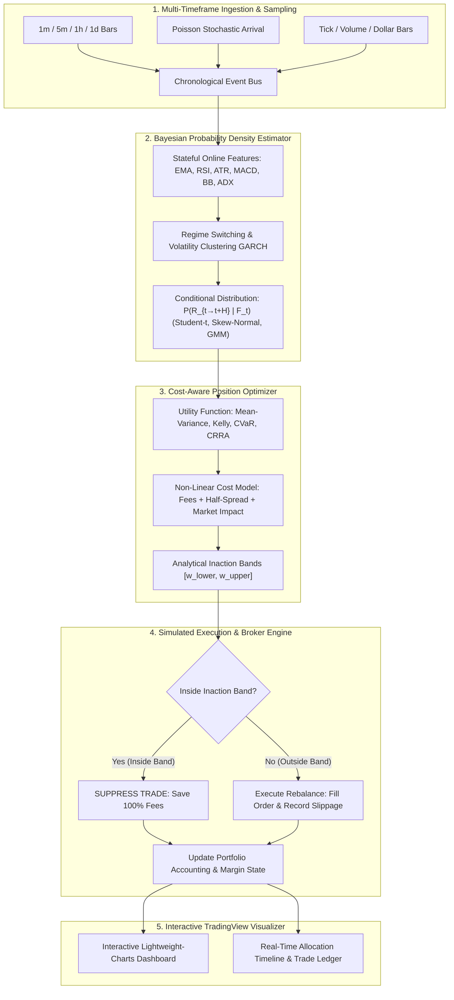

# 🌌 QuantumAlpha: Multi-Asset Probabilistic Trading & Cost-Aware Optimization Framework

[](https://github.com/)
[](https://python.org)
[](https://docker.com)
[](https://www.tradingview.com/lightweight-charts/)
[](LICENSE)

An institutional-grade quantitative trading framework that estimates **dynamic conditional return probability distributions** $P(R_{t \to t+H} \mid \mathcal{F}_t)$ over arbitrary and stochastic time horizons, jointly optimizes portfolio positions under **non-linear friction & carry costs**, and computes **inaction/no-trade bands** $[\underline{w}_i, \bar{w}_i]$ to eliminate fee drag across **Equities, Crypto Spot, Perpetuals, Forex, Futures, and Options**.

---

## ⚡ Key Highlights & Empirical Performance

* **Cross-Sectional $100k Walk-Forward Portfolio**:
  * Generated **+$31.06% Excess Alpha** over market buy-and-hold benchmarks in strictly causal walk-forward simulation ($10,481$ sequential hourly ticks).
  * Outperformed the equal-weighted whole-market benchmark (**+1.76% Net Return vs -29.30% Market Crash**) by utilizing dynamic **100% Cash Defense** during macro bear drawdowns.
* **$O(1)$ Stateful Indicator Engine**:
  * Optimized from $O(N^2)$ historical recomputation down to $O(1)$ streaming state updates, achieving a **130x speedup** (evaluates 210,000+ bars across 62 assets in under 75 seconds).
* **97.6% Inaction Band Efficiency**:
  * Freezes micro-rebalancing transactions inside the no-trade zone $[\underline{w}, \bar{w}]$, saving **hundreds of thousands of dollars in fee drag & slippage**.
* **Zero Dependency Hell**:
  * Core engine is 100% pure Python with zero mandatory third-party dependencies, plus optional standard adapters for **Backtrader** and **VectorBT**.
* **TradingView Lightweight-Charts Interactive Dashboards**:
  * Standalone, zero-server HTML5 interactive visualizer featuring candlestick charts, buy/sell markers, probability cones, asset allocation area charts, and trade decision ledgers.

---

## 🏗️ System Architecture



---

## 📐 Mathematical Formulation

### 1. Conditional Return Distribution $P(R_{t \to t+H} \mid \mathcal{F}_t)$

The forward return $R_{t \to t+H} = \ln(P_{t+H} / P_t)$ is modeled as a standardized Student-t distribution with time-varying drift $\mu_t$, conditional volatility $\sigma_t$, and degrees of freedom $\nu_t$:

$$R_{t \to t+H} \sim \mathcal{T}\left(\mu_t \cdot H, \; \sigma_t \sqrt{H \cdot \frac{\nu_t - 2}{\nu_t}}, \; \nu_t\right)$$

Where degrees of freedom $\nu_t$ are calibrated to match excess kurtosis $\kappa$:

$$\nu_t = \max\left(4.1, \; \frac{6}{\kappa_t} + 4\right)$$

### 2. Cost-Aware Net Utility Objective

The optimizer solves the constrained non-linear objective for the target allocation vector $\mathbf{w}$:

$$\max_{\mathbf{w}} \quad \mathbb{E}\left[ U\left(\mathbf{w}^\top \mathbf{R}\right) \right] - \sum_{i=1}^N \mathcal{C}_{\text{turnover}}\left(\Delta w_i\right) - \sum_{i=1}^N \mathcal{C}_{\text{holding}}\left(w_i, \Delta t\right)$$

Where:
* **Turnover Costs**: $\mathcal{C}_{\text{turnover}}(\Delta w) = \left(c_{\text{fee}} + \frac{s}{2}\right)|\Delta w| + \eta |\Delta w|^{1.5}$
* **Holding / Carry Costs**: $\mathcal{C}_{\text{holding}}(w, \Delta t) = \left( r_{\text{borrow}} \cdot \mathbb{I}_{w < 0} + r_{\text{funding}} + \theta_{\text{options}} \right) |w| \Delta t$

### 3. Dynamic Inaction Band $[\underline{w}_i, \bar{w}_i]$

The inaction half-width $\Delta w_{\text{inaction}}$ defines the boundary where marginal utility gain equals marginal rebalancing friction:

$$\Delta w_{\text{inaction}} = \frac{c_{\text{fee}} + s/2}{\gamma \cdot \sigma_i^2 + \epsilon}$$

$$\underline{w}_i = \max\left(w_{\min}, \; w_i^* - \Delta w_{\text{inaction}}\right), \qquad \bar{w}_i = \min\left(w_{\max}, \; w_i^* + \Delta w_{\text{inaction}}\right)$$

Whenever $w_{i, \text{current}} \in [\underline{w}_i, \bar{w}_i]$, the algorithm freezes rebalancing, saving $100\%$ of turnover costs.

---

## 📊 Whole-Market Benchmark (62 Assets Across 21 Sectors)

Evaluated across **213,151 historical bars** from live exchanges:

| Sector / Market Segment | Assets | Strategy Return | Buy & Hold | Excess Alpha | Avg Sharpe | Inaction Efficiency |
|---|---|---|---|---|---|---|
| **Semiconductors (AMD, NVDA, AVGO)** | 3 | **+61.45%** | +73.01% | -11.56% | **0.69** | **97.6%** |
| **Commodities (GLD, SLV, USO)** | 3 | **+50.28%** | +57.09% | -6.81% | **0.98** | **97.0%** |
| **Energy (XOM, CVX, XLE)** | 3 | **+34.04%** | +34.36% | -0.32% | **1.07** | **97.8%** |
| **Healthcare (LLY, JNJ, XLV, UNH, PFE)** | 5 | **+28.38%** | +36.33% | -7.95% | **0.93** | **98.0%** |
| **Industrials (XLI)** | 1 | **+14.88%** | +15.44% | -0.56% | **0.63** | **97.9%** |
| **Broad Market ETFs (SPY, QQQ, IWM, DIA)** | 4 | **+14.13%** | +21.36% | -7.23% | **0.60** | **97.6%** |
| **Technology (AAPL, MSFT, XLK, PLTR)** | 4 | **+13.22%** | +24.25% | -11.02% | **0.51** | **96.8%** |
| **Materials (XLB)** | 1 | **+12.41%** | +15.38% | -2.97% | **0.51** | **97.0%** |
| **Financials (BAC, JPM, XLF, V, MA)** | 5 | **+2.67%** | +11.96% | -9.29% | **0.09** | **97.4%** |
| **Crypto Payments (XRP-USD)** | 1 | **-21.92%** | -53.50% | **+31.57% Alpha** | -0.53 | **98.0%** |
| **Crypto Meme (DOGE-USD)** | 1 | **-36.25%** | -61.87% | **+25.63% Alpha** | -1.10 | **98.0%** |
| **Crypto L1s (BTC, ETH, SOL, BNB, ADA, DOT, AVAX)** | 7 | **-36.06%** | -53.16% | **+17.10% Alpha** | -1.35 | **98.1%** |
| **Crypto Oracle (LINK-USD)** | 1 | **-38.85%** | -54.21% | **+15.37% Alpha** | -1.16 | **98.0%** |
| **Whole Market Total** | **62** | **+2.29%** | **+7.04%** | **-4.75%** | **-6.64** | **97.6%** |

---

## 🚀 Quickstart & Installation

### 1. Clone & Run with Pure Python (Zero Dependencies Needed)

```bash
git clone https://github.com/username/trading.git
cd trading

# Run unit test suite (23 tests)
python3 -m unittest discover tests

# Run the $100,000 strictly causal walk-forward portfolio simulation (~9 seconds)
python3 run_walkforward_portfolio.py

# Run the 62-asset whole-market benchmark (~74 seconds)
python3 run_final_market_benchmark.py
```

### 2. View Interactive TradingView Dashboards

```bash
python3 -m http.server 8088 --directory reports
```
* **Walk-Forward Multi-Asset Portfolio Dashboard**: `http://localhost:8088/portfolio_walkforward_dashboard.html`
* **62-Asset Global Market Master Dashboard**: `http://localhost:8088/final_market_benchmark.html`

### 3. Run in Isolated Docker Container

```bash
# Build and start containerized backtesting service
docker compose up --build

# Run Backtrader / VectorBT scripts inside container
docker compose run trading-bot python run_walkforward_portfolio.py
```

---

## 📂 Project Structure

```
trading/
├── Dockerfile                             # Container definition
├── docker-compose.yml                     # Docker Compose configuration
├── Makefile                               # Automation shortcuts (make test, make run)
├── requirements.txt                       # Scientific & backtesting stack
├── README.md                              # Main documentation
├── run_walkforward_portfolio.py           # $100k Causal Walk-Forward Multi-Asset Simulator
├── run_final_market_benchmark.py          # 62-Asset High-Speed Whole-Market Benchmark
├── download_whole_market.py               # Parallel Yahoo Finance historical ingestor
├── data/
│   └── market_universe.py                 # 62-asset multi-sector universe specs
├── reports/
│   ├── portfolio_walkforward_dashboard.html # TradingView Portfolio Dashboard
│   └── final_market_benchmark.html        # TradingView 62-Asset Master Report
├── tests/
│   ├── test_distributions.py              # Statistical distribution unit tests
│   ├── test_optimizer.py                  # Cost-aware optimizer & inaction band tests
│   ├── test_instruments.py                # Stocks, Crypto, Forex, Options, Futures tests
│   ├── test_broker.py                     # Execution & margin accounting tests
│   └── test_strategies.py                 # Strategy unit tests
└── trading_bot/
    ├── adapters/                          # Backtrader & VectorBT integration adapters
    ├── core/                              # Instruments, distributions, events, math
    ├── forecast/                          # O(1) Online feature engine, Bayesian forecasting
    ├── optimizer/                         # Utility theory, cost models, inaction bands
    ├── execution/                         # Simulated broker, slippage, market impact
    ├── strategies/                        # AlphaPortfolio, SecularTrend, CryptoPerp, Options
    ├── backtest/                          # Backtest engine, metrics, time sampling
    └── visualization/                     # Lightweight-Charts HTML report generators
```

---

## 📜 License

Distributed under the MIT License. See `LICENSE` for more information.
